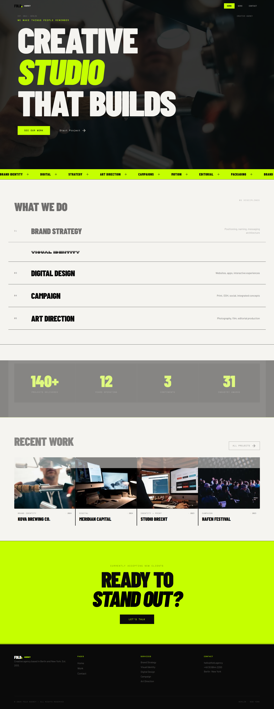
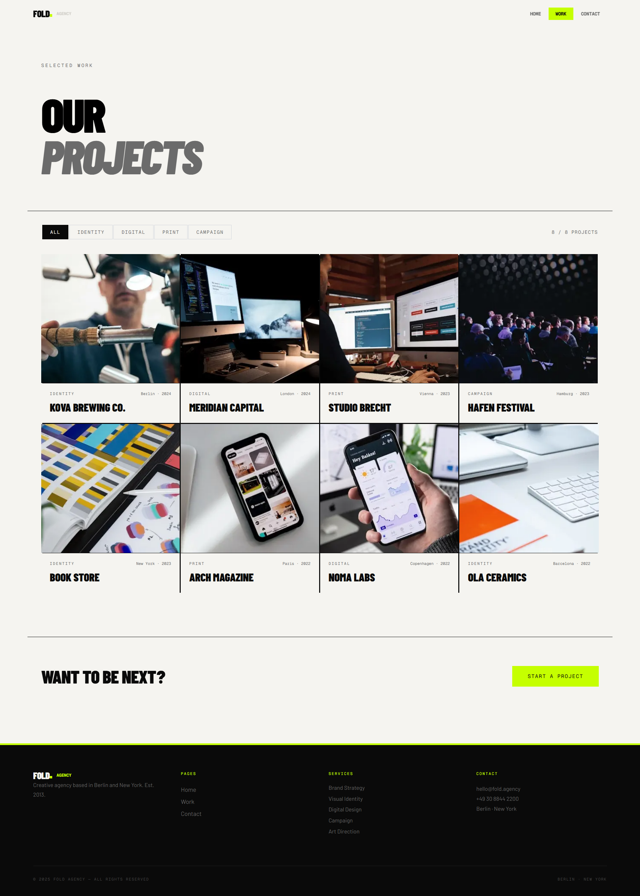
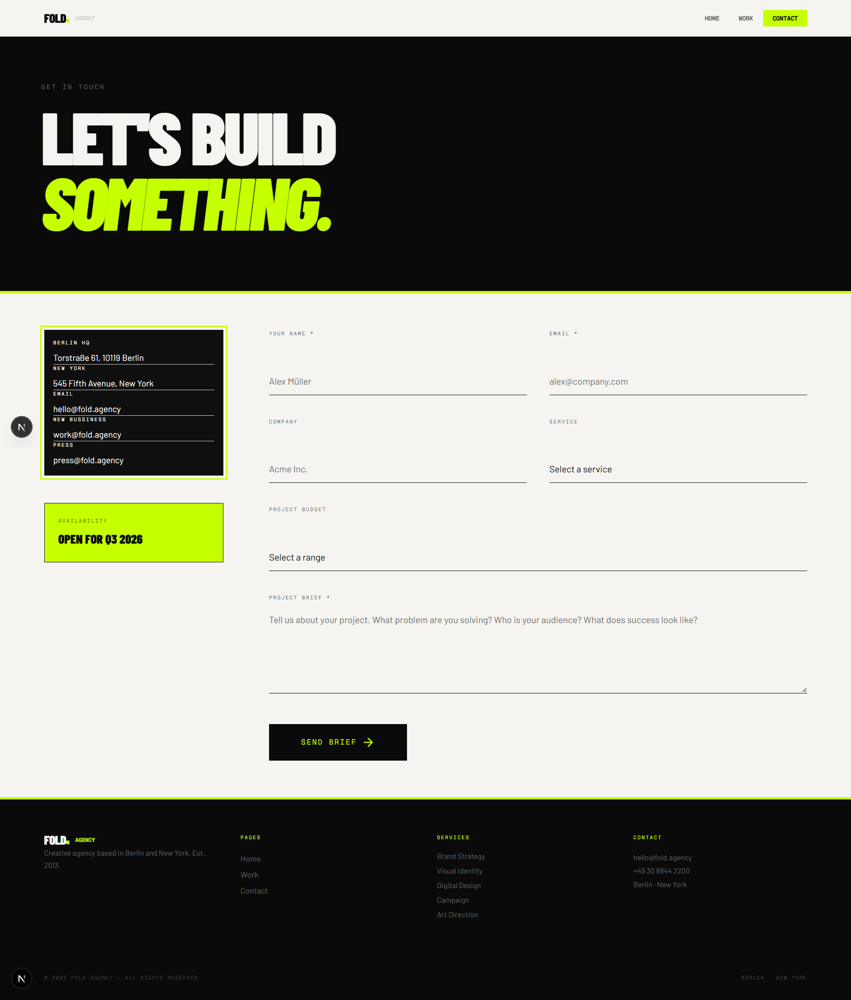

# Fold Agency

A modern and responsive creative agency website built with **Next.js**, **TypeScript**, and **Tailwind CSS**. The project showcases a bold editorial-style design with smooth interactions, reusable components, and a clean folder structure.

## Live Demo

🔗 https://fold-agency.vercel.app/

## GitHub Repository

🔗 https://github.com/abdulrahman-shoaib2/Fold_Agency

---

## Features

* Responsive design for desktop, tablet, and mobile devices
* Modern creative agency UI
* Multi-page routing with Next.js App Router
* Reusable and maintainable components
* Interactive hover effects and animations
* Project showcase section
* Services section
* Statistics section
* Contact form UI
* Optimized performance with Next.js

---

## Tech Stack

* Next.js 15
* React 19
* TypeScript
* Tailwind CSS
* Motion (for animations)

---

## Pages

### Home

* Hero section
* Services section
* Agency statistics
* Featured projects
* Call-to-action section

### Work

* Project portfolio grid
* Category filtering
* Responsive project cards

### Contact

* Agency information
* Contact form
* Success state after submission

---

## Project Structure

```bash
src/
├── app/
│   ├── page.tsx
│   ├── work/
│   └── contact/
│
├── components/
│   ├── Navbar
│   ├── Footer
│   ├── Hero
│   ├── Services
│   ├── Stats
│   └── Projects
│
├── data/
├── hooks/
├── styles/
└── utils/
```

---

## Getting Started

### Clone the repository

```bash
git clone https://github.com/abdulrahman-shoaib2/Fold_Agency.git
```

### Navigate to the project

```bash
cd Fold_Agency
```

### Install dependencies

```bash
npm install
```

### Run the development server

```bash
npm run dev
```

Open:

```bash
http://localhost:3000
```

---

## Build for Production

```bash
npm run build
npm start
```

---

## Design Goals

This project focuses on:

* Clean code architecture
* Component reusability
* Responsive layouts
* Performance optimization
* Consistent design system
* Modern frontend development practices

---

## Screenshots
### Home Page


### Work Page


### Contact Page



## Author

**Abdulrahman Mohsen Shoaib**

* GitHub: https://github.com/abdulrahman-shoaib2
* LinkedIn: [www.linkedin.com/in/abd-sh](http://www.linkedin.com/in/abd-sh)
